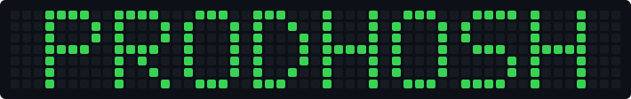
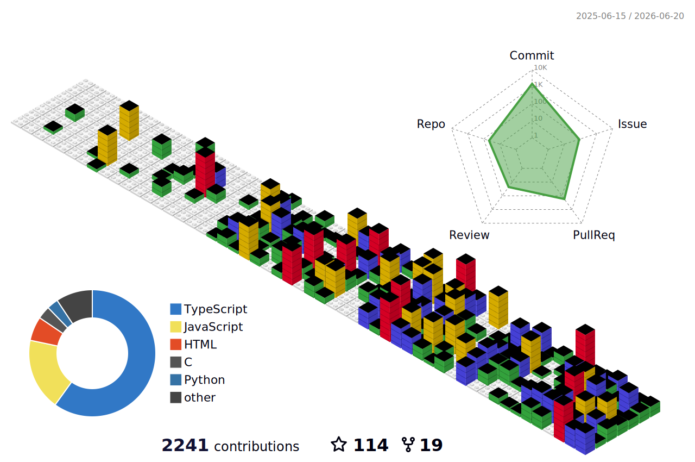

---

## whoami

---

## Contributions

---

## About

CS Sophomore at VIT Chennai and IIT Madras BS Data Science.

I like building things that people actually use.

I'm interested in AI engineering and building products that can think, learn, and scale. Most of my time is spent designing and developing SaaS-style platforms, developer tools, and software solutions for businesses, communities, and organizations.

Over the past few years, I've worked on 7+ freelance projects, built products used by thousands of users, contributed to open source, and launched everything from learning platforms and analytics tools to AI-powered applications.

I enjoy working across the entire stack, from UI and user experience to architecture, databases, APIs, performance, SEO, and system design. Currently, I'm focused on full stack development, AI products, and becoming a better engineer with every project I build.

If you're building something interesting, looking for a collaborator, or looking to hire, feel free to reach out at [hello@prodhosh.me](mailto:hello@prodhosh.me).

<pre>
██████╗ ██████╗  ██████╗ ██████╗ ██╗  ██╗ ██████╗ ███████╗██╗  ██╗
██╔══██╗██╔══██╗██╔═══██╗██╔══██╗██║  ██║██╔═══██╗██╔════╝██║  ██║
██████╔╝██████╔╝██║   ██║██║  ██║███████║██║   ██║███████╗███████║
██╔═══╝ ██╔══██╗██║   ██║██║  ██║██╔══██║██║   ██║╚════██║██╔══██║
██║     ██║  ██║╚██████╔╝██████╔╝██║  ██║╚██████╔╝███████║██║  ██║
╚═╝     ╚═╝  ╚═╝ ╚═════╝ ╚═════╝ ╚═╝  ╚═╝ ╚═════╝ ╚══════╝╚═╝  ╚═╝
</pre>

---

## What's in the toolbox

The languages, frameworks, and infra that show up in my projects more than I'd like to admit.

                            

---

## Trophy case

A quick scoreboard of what GitHub has tracked about me so far. Commits, stars, pull requests, the whole stack, pulled live every time someone loads this page.

---

## Badges

A few digital badges I've picked up from communities and events along the way. Click through to see the full collection.

---

## Connect

---

## Leave a message

If you have something to say, a question, feedback, or just want to say hi, open a thread in [Discussions](https://github.com/PRODHOSH/PRODHOSH/discussions). I read every one of them.

<picture>
  <source media="(prefers-color-scheme: dark)" srcset="https://raw.githubusercontent.com/platane/snk/output/github-contribution-grid-snake-dark.svg">
  <source media="(prefers-color-scheme: light)" srcset="https://raw.githubusercontent.com/platane/snk/output/github-contribution-grid-snake.svg">
  
</picture>

---

Thanks for visiting. Feel free to say hi.

