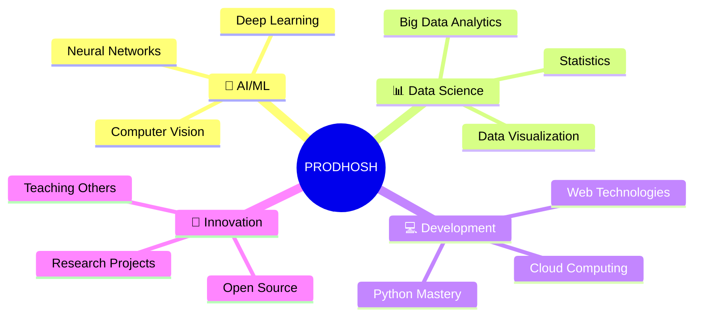

# 💫 **PRODHOSH** 💫

<div align="center">


### 🚀 *"I love math so much that I chose Data Science just to live in numbers!"* 😅


</div>

---

## 🌟 **About Me** 🌟


```python
class DataScientist:
    def __init__(self):
        self.name = "Prodhosh"
        self.role = "ML Enthusiast & Data Explorer"
        self.language_spoken = ["Python", "C++", "JavaScript", "SQL"]
        self.current_focus = "Machine Learning & Statistics"
        self.fun_fact = "Living in numbers, dreaming in algorithms"
        self.coffee_consumed = "∞"
    
    def say_hi(self):
        print("Thanks for dropping by! Let's build something amazing together!")
        return "🚀 Ready to innovate!"

me = DataScientist()
me.say_hi()
```

<details>
<summary>🔭 <b>What I'm Currently Working On</b></summary>
<br>

- 🧠 **Deep Learning** with Neural Networks
- 📊 **Statistical Analysis** and Data Modeling  
- 🤖 **Machine Learning Algorithms** implementation
- 📈 **Data Visualization** with advanced techniques
- 🔍 **Exploratory Data Analysis** on real-world datasets

</details>

<details>
<summary>👯 <b>Looking to Collaborate On</b></summary>
<br>

- 🌐 **Open Source Projects** in AI/ML
- 📊 **Data Science Competitions** (Kaggle, etc.)
- 🤖 **Machine Learning Research** projects
- 📱 **AI Applications** for real-world problems
- 🎓 **Educational Content** for beginners

</details>

<details>
<summary>🤝 <b>How I Can Help You</b></summary>
<br>

- 🐍 **Python Programming** (Beginner to Intermediate)
- ⚡ **C++ Development** and Problem Solving
- 📊 **Data Analysis** and Visualization
- 🤖 **Machine Learning** concepts and implementation
- 💡 **Learning Strategies** for tech skills

</details>

<details>
<summary>🌱 <b>Currently Learning</b></summary>
<br>

- 📊 **Advanced Statistics** for Machine Learning
- 🧮 **Mathematics** for Data Science
- 🔥 **Deep Learning** frameworks (TensorFlow, PyTorch)
- 📈 **Time Series Analysis**
- 🎯 **MLOps** and Model Deployment

</details>

<details>
<summary>💬 <b>Ask Me About</b></summary>
<br>

- 💻 **Coding Best Practices** and Clean Code
- 🚀 **Productivity Hacks** for developers
- 📚 **Learning Strategies** for self-taught programmers
- 🎯 **Goal Setting** and skill development
- 🔍 **Data Analysis** techniques and tools

</details>

---

## 💻 **Tech Arsenal** 💻

<div align="center">

### **⚡ My Tech Stack ⚡**

<table>
  <tr>
    <td align="center" width="96">
      <a href="#" >
        
      </a>
      <br>Python
    </td>
    <td align="center" width="96">
      <a href="#" >
        
      </a>
      <br>C++
    </td>
    <td align="center" width="96">
      <a href="#" >
        
      </a>
      <br>JavaScript
    </td>
    <td align="center" width="96">
      <a href="#" >
        
      </a>
      <br>MySQL
    </td>
    <td align="center" width="96">
      <a href="#" >
        
      </a>
      <br>Git
    </td>
    <td align="center" width="96">
      <a href="#" >
        
      </a>
      <br>GitHub
    </td>
    <td align="center" width="96">
      <a href="#" >
        
      </a>
      <br>HTML5
    </td>
    <td align="center" width="96">
      <a href="#" >
        
      </a>
      <br>CSS3
    </td>
  </tr>
  <tr>
    <td align="center" width="96">
      <a href="#" >
        
      </a>
      <br>TensorFlow
    </td>
    <td align="center" width="96">
      <a href="#" >
        
      </a>
      <br>PyTorch
    </td>
    <td align="center" width="96">
      <a href="#" >
        
      </a>
      <br>Scikit-learn
    </td>
    <td align="center" width="96">
      <a href="#" >
        
      </a>
      <br>OpenCV
    </td>
    <td align="center" width="96">
      <a href="#" >
        
      </a>
      <br>Jupyter
    </td>
    <td align="center" width="96">
      <a href="#" >
        
      </a>
      <br>VS Code
    </td>
    <td align="center" width="96">
      <a href="#" >
        
      </a>
      <br>Docker
    </td>
    <td align="center" width="96">
      <a href="#" >
        
      </a>
      <br>AWS
    </td>
  </tr>
</table>

<br/>

</div>

---

## 📊 **GitHub Analytics** 📊

<div align="center">

<table>
  <tr>
    <td>
      
    </td>
    <td>
      
    </td>
  </tr>
</table>


<br/>


<br/>


</div>

---

## 🔥 **Skills & Expertise** 🔥

<div align="center">

### 💪 **Programming Proficiency**

<table>
  <tr>
    <td>
      
      <br><b>Python</b>
      <br>🟩🟩🟩🟩🟩 90%
    </td>
    <td>
      
      <br><b>C++</b>
      <br>🟩🟩🟩🟩⬜ 75%
    </td>
    <td>
      
      <br><b>JavaScript</b>
      <br>🟩🟩🟩🟨⬜ 70%
    </td>
    <td>
      
      <br><b>SQL</b>
      <br>🟩🟩🟩🟩⬜ 80%
    </td>
  </tr>
</table>

### 🧠 **AI/ML Expertise**

<table>
  <tr>
    <td align="center">
      
      <br><b>Machine Learning</b>
      <br>🟩🟩🟩🟩⬜ 80%
    </td>
    <td align="center">
      
      <br><b>Deep Learning</b>
      <br>🟩🟩🟩🟨⬜ 65%
    </td>
    <td align="center">
      
      <br><b>Data Analysis</b>
      <br>🟩🟩🟩🟩🟩 85%
    </td>
  </tr>
</table>

</div>

---

## 🌐 **Connect & Collaborate** 🌐

<div align="center">

[](https://linkedin.com/in/prodhoshvs)
[](https://instagram.com/itzprodhosh)
[](mailto:prodhosh3@gmail.com)
[](https://github.com/PRODHOSH)

### 💬 **Let's Build Something Amazing Together!**


</div>

---

## 🎯 **Current Focus Areas** 🎯

<div align="center">


```mermaid
mindmap
  root((PRODHOSH))
    🧠 AI/ML
      Deep Learning
      Neural Networks
      Computer Vision
    📊 Data Science  
      Statistics
      Data Visualization
      Big Data Analytics
    💻 Development
      Python Mastery
      Web Technologies
      Cloud Computing
    🚀 Innovation
      Open Source
      Research Projects
      Teaching Others
```

</div>

---

## 🏆 **Achievements & Certifications** 🏆

<div align="center">

| 🎓 **Learning** | 🏅 **Achievements** | 🚀 **Goals** |
|:-:|:-:|:-:|
| Machine Learning Specialization | 100+ Problems Solved | Contribute to Open Source |
| Data Science Fundamentals | GitHub Streak Champion | Build ML Applications |
| Python Advanced Programming | Community Helper | Mentor Beginners |

</div>

---

## 💡 **Daily Inspiration** 💡

<div align="center">


</div>

---

## 🐍 **GitHub Contribution Snake** 🐍

<div align="center">

### **🎮 Watch the Snake Eat My Contributions!**

<picture>
  <source media="(prefers-color-scheme: dark)" srcset="https://raw.githubusercontent.com/PRODHOSH/PRODHOSH/output/github-contribution-grid-snake-dark.svg" />
  <source media="(prefers-color-scheme: light)" srcset="https://raw.githubusercontent.com/PRODHOSH/PRODHOSH/output/github-contribution-grid-snake.svg" />
  
</picture>

</div>

---

## ⚡ **Coding Activity** ⚡

<div align="center">

<!--START_SECTION:waka-->
```text
Python       8 hrs 30 mins   ████████████████░░░░░░   65.2%
JavaScript   2 hrs 15 mins   ████░░░░░░░░░░░░░░░░░░░░   17.3%
SQL          1 hr 20 mins    ██░░░░░░░░░░░░░░░░░░░░░░   10.2%
HTML/CSS     45 mins         █░░░░░░░░░░░░░░░░░░░░░░░    5.8%
Other        15 mins         ░░░░░░░░░░░░░░░░░░░░░░░░    1.5%
```
<!--END_SECTION:waka-->

### 🎯 **Weekly Focus**
- 🐍 **Deep Learning with PyTorch**
- 📊 **Statistical Analysis Projects** 
- 🔍 **Data Visualization Techniques**
- 💻 **Open Source Contributions**

</div>

---

## 🎉 **Fun Zone** 🎉

<div align="center">

<details>
<summary><b>🎭 Random Developer Facts About Me</b></summary>
<br>

- 🧮 **Math Enthusiast**: I solve differential equations for fun
- 📊 **Data Storyteller**: Every dataset has a hidden narrative  
- 🌙 **Night Coder**: Peak productivity hits after 10 PM
- ☕ **Coffee Connoisseur**: Fuel gauge always reads "More Coffee"
- 🎵 **Lo-fi Listener**: Coding soundtrack = chill beats
- 🔍 **Bug Hunter**: Debugging is like solving puzzles
- 🚀 **Future Builder**: Dreaming of AI that helps humanity
- 📚 **Eternal Student**: Always something new to learn in tech

```python
def developer_life():
    while True:
        coffee.drink()
        code.write()
        if bug_found:
            debug(patience=True)
        else:
            celebrate_small_wins()
        learn_something_new()
```

</details>

</div>

---

## 🌟 **Final Words** 🌟

<div align="center">


### **💫 "In the world of data, every number tells a story, and I'm here to listen." 💫**


<sub>⭐ **Don't forget to star my repositories if you find them interesting!** ⭐</sub>

</div>

<!-- Easter Egg: If you read this far, you're awesome! 🚀 -->
<!-- Made with 💜 by PRODHOSH -->
